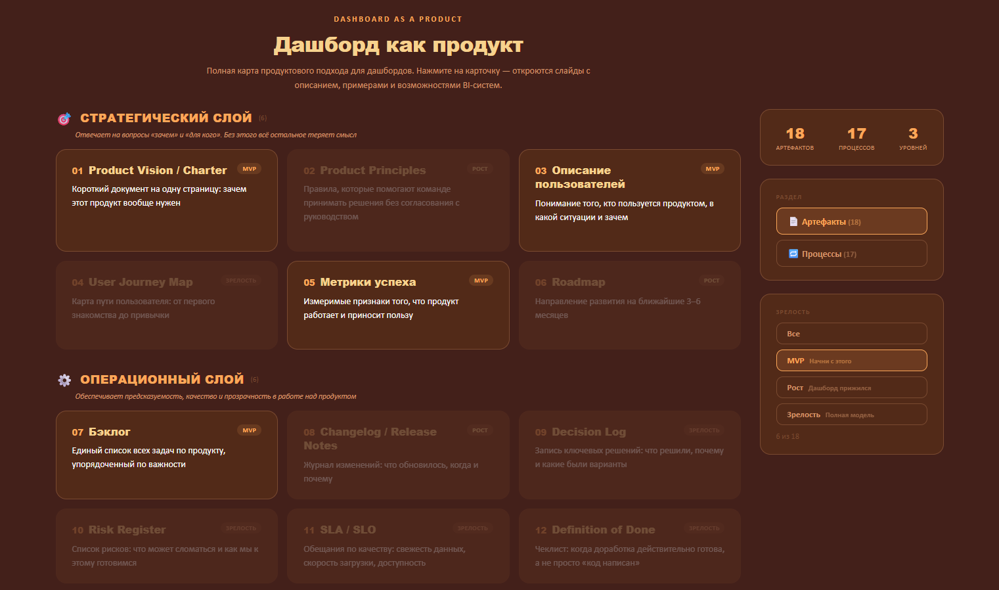

# Дашборд как продукт

**Продукт:** интерактивная карта продуктового подхода к BI  
**Роль:** Product Manager / Author  
**Контекст:** 18 артефактов и 17 процессов с примерами для Power BI, Tableau, Looker

**Результат:** BI как продукт — артефакты, процессы и зрелость, а не «нарисовать графики».

**Сайт:** [addito-5g.github.io/Dashbord-as-product](https://addito-5g.github.io/Dashbord-as-product/)



---

## Структура

```
├── index.html           — React-приложение
├── data-artifacts.js    — 18 артефактов (4 слоя)
├── data-processes.js    — 17 процессов (6 фаз)
└── assets/              — ~100 PNG
```

## Запуск

```bash
python3 -m http.server 8080
# → http://localhost:8080
```

## Контрибьют

Тексты карточек — в `data-artifacts.js` и `data-processes.js`. Поля карточки:

```js
{
  n: 1,
  name: "Product Vision",
  short: "...",
  detail: `...`,      // markdown
  dashboard: `...`,
  bi: `...`,
  maturity: "mvp",    // mvp | growth | mature
}
```

Картинки: `assets/`, префиксы `a01-`…`a18-`, `p01-`…`p17-`. Рекомендуемая ширина — 1024px PNG.

> `index.html` — только при изменении логики отображения.
